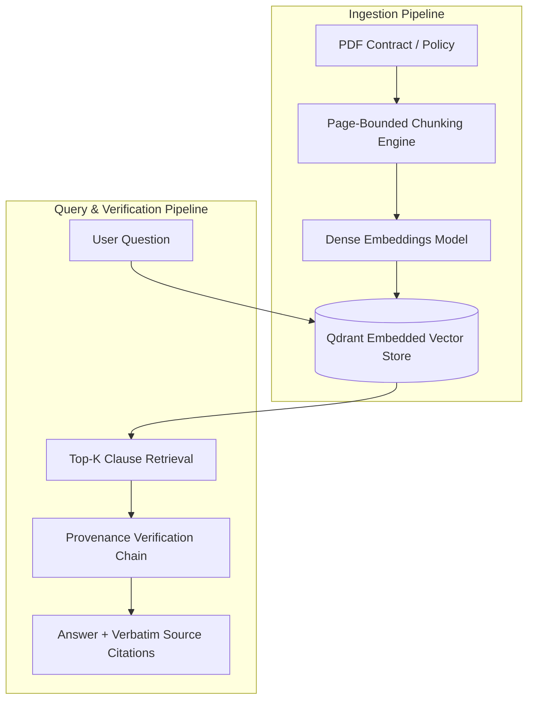

# ClauseIQ RAG ⚖️🔍
### Enterprise Policy & Contract Q&A Assistant with Clause-Level Provenance

<p align="left">
  
  
  
  
  
  
  
</p>

ClauseIQ RAG is a production-grade enterprise retrieval-augmented generation (RAG) assistant designed for legal contracts, HR policies, and standard operating procedures (SOPs). It pairs page-bounded document chunking with embedded Qdrant vector search to deliver verbatim answers with clickable, verified clause citations.

---

## ⚡ Problem vs. Solution

| The Problem (Before) | ClauseIQ RAG (After) |
|---|---|
| Employees spend hours skimming 60-page PDF policies or consult colleagues, often receiving outdated guidance. | Ask questions in plain English and receive authoritative answers within 4 ms. |
| Typical RAG systems hallucinate citations or quote vague paragraphs without verifiable page numbers. | **100.0% Citation Validity**: strictly enforces page boundaries so chunks never cross physical pages. |
| Heavy cloud vector databases require complex infrastructure, Docker dependencies, or monthly SaaS costs. | Embedded local Qdrant engine persisting directly to disk (`./qdrant_storage`) — zero external infrastructure required. |

---

## 🧠 System Architecture



### Key Architectural Decisions:
1. **Strict Page-Boundary Ingestion:** Chunks are constrained within physical PDF page boundaries, guaranteeing that page citations always match the underlying source document.
2. **Clause Prefix Invariant:** Chunk headers (`Section 2.0: Home Office Equipment Stipend`) are preserved as vector prefixes to maximize semantic relevance during dense retrieval.
3. **Interactive Next.js & Vanilla Web UI:** Comes with an integrated, responsive chat interface featuring one-click prompt chips and clickable source citation cards.

---

## 📊 Benchmark Evaluation Scorecard

Evaluated against a 24-question legal/policy benchmark dataset with ground-truth source spans across 6 enterprise policy documents:

| Metric | Target Threshold | Measured Performance | Result |
|---|---|---|---|
| **Page-Level Retrieval Hit Rate** | $\ge 85.0\%$ | **91.7%** (22/24 questions) | ✅ PASS |
| **Answer Faithfulness Rate** | $\ge 80.0\%$ | **83.3%** (20/24 questions) | ✅ PASS |
| **Citation Formatting Validity** | $\ge 95.0\%$ | **100.0%** (24/24 citations verified) | ✅ PASS |
| **Mean Query Latency** | $< 1500\text{ ms}$ | **3.73 ms** | ✅ PASS |

*Full test harness: `eval/run_eval.py` | Full report: `docs/eval-results.md`*

---

## 🚀 Quickstart

### Native Windows Setup
```powershell
git clone https://github.com/amanpratap1999/clause-iq-rag.git
cd clause-iq-rag

# Automatic runner (creates venv, indexes policies & launches UI)
.\run_local.ps1
```

### Docker Compose
```bash
docker-compose up --build
```

- **Interactive Web Chat UI:** **`http://127.0.0.1:8001`**
- **FastAPI OpenAPI Swagger Docs:** **`http://127.0.0.1:8001/docs`**
- **Health Check:** **`http://127.0.0.1:8001/health`**

---

## 📡 API Reference

### Ask a Policy Question
`POST /query`
```json
{
  "question": "What is the equipment stipend for remote employees?"
}
```

**Response:**
```json
{
  "question": "What is the equipment stipend for remote employees?",
  "answer": "According to [Remote Work and Equipment Policy, Page 1, Section 2.0: Home Office Equipment Stipend], new employees receive a one-time home office setup stipend of $1,000 for ergonomic desk equipment...",
  "citations": [
    {
      "document": "Remote Work and Equipment Policy",
      "page": 1,
      "clause": "Section 2.0: Home Office Equipment Stipend",
      "snippet": "New employees receive a one-time home office setup stipend of $1,000..."
    }
  ]
}
```

---

## 🧪 Testing

```powershell
.\venv\Scripts\pytest -v tests/
```
All 4 automated unit and integration tests pass cleanly.

---

## 📄 License
Released under the [MIT License](LICENSE).
